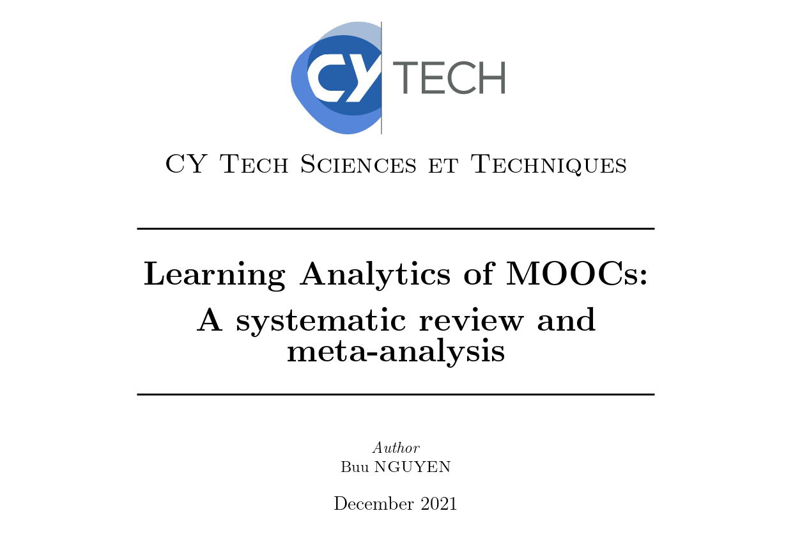
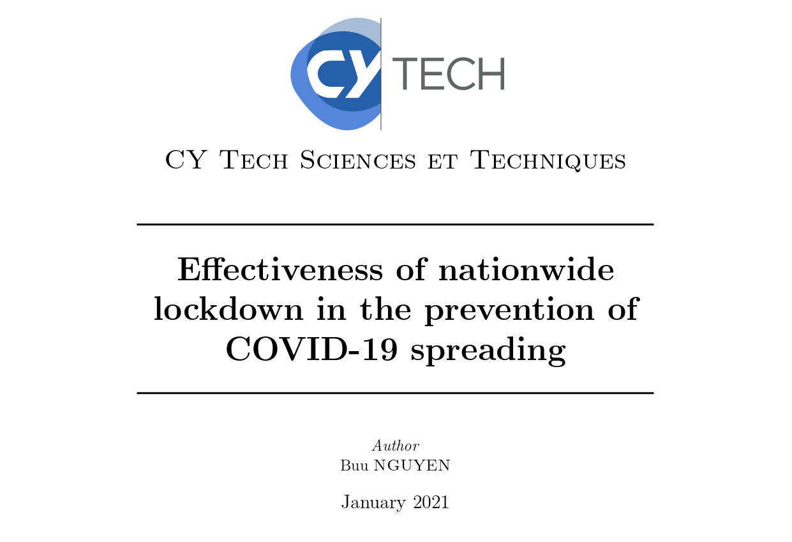

# Portfolio
---
## Data Science

### Learning Analytics of MOOCs: A systematic review and meta-analysis

 

 

---
### Effectiveness of nationwide lockdown in the prevention of COVID-19 spreading

 

 
---

© 2021 Buu NGUYEN. Powered by <a href="https://jekyllrb.com/">Jekyll</a> and <a href="https://pages-themes.github.io/minimal/">Minimal theme</a>.

